# Database schema

This is an **application-time temporal** database, so the relationships that
matter are not only the usual `id` foreign keys but also the **PERIOD foreign
keys** that chain facts together *in time*. There are no Ecto schemas or Ash
resources to read the relationships off — the schema lives in
`server/priv/migrations/` (DDL) and access goes through Squirrel-generated query
bindings (`server/src/tempo/server/sql.gleam`), which are typed per query and
deliberately say nothing about how the tables relate. This document is that
missing relationship map. (See `ARCHITECTURE.md` §4/§7 for the why.)

## Entity-relationship diagram

> **Generated from the live database by `bin/erd`** (it reads `pg_catalog`, so the
> diagram reflects what the migrations actually built — including the temporal
> foreign keys). Re-run `bin/erd` after a migration to refresh. View it rendered on
> GitHub or in an editor with a Mermaid preview. `event_log` stands alone (no
> foreign keys by design — it is the provenance journal beside the facts).

```mermaid
erDiagram
  allocation ||--o{ timesheet : "PERIOD FK"
  client ||--o{ client_profile : "FK"
  client ||--o{ contract_terms : "FK"
  contract_terms ||--o{ project_run : "PERIOD FK"
  contract ||--o{ contract_terms : "FK"
  employment ||--o{ allocation : "PERIOD FK"
  employment ||--o{ engineer_role : "PERIOD FK"
  employment ||--o{ leave : "PERIOD FK"
  engineer ||--o{ employment : "FK"
  engineer ||--o{ engineer_banking : "FK"
  engineer ||--o{ engineer_contact : "FK"
  engineer ||--o{ engineer_emergency : "FK"
  engineer ||--o{ invoice_line : "FK"
  engineer ||--o{ payroll_line : "FK"
  event_log ||--o{ allocation : "FK"
  event_log ||--o{ client_profile : "FK"
  event_log ||--o{ contract_terms : "FK"
  event_log ||--o{ employment : "FK"
  event_log ||--o{ engineer_banking : "FK"
  event_log ||--o{ engineer_contact : "FK"
  event_log ||--o{ engineer_emergency : "FK"
  event_log ||--o{ engineer_role : "FK"
  event_log ||--o{ invoice_line : "FK"
  event_log ||--o{ invoice_status : "FK"
  event_log ||--o{ invoice_subject : "FK"
  event_log ||--o{ leave : "FK"
  event_log ||--o{ leave_policy : "FK"
  event_log ||--o{ payroll_line : "FK"
  event_log ||--o{ payroll_period : "FK"
  event_log ||--o{ project_plan : "FK"
  event_log ||--o{ project_profile : "FK"
  event_log ||--o{ project_run : "FK"
  event_log ||--o{ rate_card : "FK"
  event_log ||--o{ salary : "FK"
  event_log ||--o{ timesheet : "FK"
  invoice ||--o{ invoice_line : "FK"
  invoice ||--o{ invoice_status : "FK"
  invoice ||--o{ invoice_subject : "FK"
  payroll_run ||--o{ payroll_line : "FK"
  payroll_run ||--o{ payroll_period : "FK"
  project_run ||--o{ allocation : "PERIOD FK"
  project_run ||--o{ invoice_subject : "PERIOD FK"
  project ||--o{ allocation : "FK"
  project ||--o{ invoice_subject : "FK"
  project ||--o{ project_plan : "FK"
  project ||--o{ project_profile : "FK"
  project ||--o{ project_run : "FK"
  allocation {
    integer engineer_id PK,FK
    integer project_id PK,FK
    numeric fraction
    daterange allocated_during PK,FK "WITHOUT OVERLAPS"
    bigint audit_id FK
  }
  client {
    integer id PK
  }
  client_profile {
    integer client_id PK,FK
    text name
    daterange recorded_during PK "WITHOUT OVERLAPS"
    bigint audit_id FK
  }
  contract {
    integer id PK
  }
  contract_terms {
    integer contract_id PK,FK
    integer client_id FK
    daterange term PK "WITHOUT OVERLAPS"
    bigint audit_id FK
  }
  employment {
    integer engineer_id PK,FK
    daterange employed_during PK "WITHOUT OVERLAPS"
    bigint audit_id FK
  }
  engineer {
    integer id PK
  }
  engineer_banking {
    integer engineer_id PK,FK
    text bank
    text branch
    text account_no
    text account_name
    daterange recorded_during PK "WITHOUT OVERLAPS"
    bigint audit_id FK
  }
  engineer_contact {
    integer engineer_id PK,FK
    text name
    text email
    text phone
    text postal_address
    daterange recorded_during PK "WITHOUT OVERLAPS"
    bigint audit_id FK
  }
  engineer_emergency {
    integer engineer_id PK,FK
    text relation
    text name
    text phone
    text email
    daterange recorded_during PK "WITHOUT OVERLAPS"
    bigint audit_id FK
  }
  engineer_role {
    integer engineer_id PK,FK
    integer level
    daterange held_during PK,FK "WITHOUT OVERLAPS"
    bigint audit_id FK
  }
  event_log {
    bigint id PK
    timestamp occurred_at
    text actor
    text operation
    text summary
    jsonb payload
  }
  invoice {
    integer id PK
  }
  invoice_line {
    integer invoice_id FK
    integer engineer_id FK
    integer level
    numeric day_rate
    numeric days
    numeric amount
    bigint audit_id FK
  }
  invoice_status {
    integer invoice_id PK,FK
    text status
    daterange status_during PK "WITHOUT OVERLAPS"
    bigint audit_id FK
  }
  invoice_subject {
    integer invoice_id PK,FK
    integer project_id FK
    daterange billing_period FK
    bigint audit_id FK
  }
  leave {
    integer engineer_id PK,FK
    text kind
    daterange on_leave_during PK,FK "WITHOUT OVERLAPS"
    bigint audit_id FK
  }
  leave_policy {
    text kind PK
    integer level PK
    numeric days_per_year
    daterange effective_during PK "WITHOUT OVERLAPS"
    bigint audit_id FK
  }
  payroll_line {
    integer run_id FK
    integer engineer_id FK
    numeric amount
    numeric days
    bigint audit_id FK
  }
  payroll_period {
    integer run_id PK,FK
    daterange period
    bigint audit_id FK
  }
  payroll_run {
    integer id PK
  }
  project {
    integer id PK
  }
  project_plan {
    integer project_id PK,FK
    numeric budget
    date target_completion
    daterange planned_during PK "WITHOUT OVERLAPS"
    bigint audit_id FK
  }
  project_profile {
    integer project_id PK,FK
    text title
    text summary
    daterange recorded_during PK "WITHOUT OVERLAPS"
    bigint audit_id FK
  }
  project_run {
    integer project_id PK,FK
    integer contract_id FK
    daterange active_during PK,FK "WITHOUT OVERLAPS"
    bigint audit_id FK
  }
  rate_card {
    integer level PK
    numeric day_rate
    daterange effective_during PK "WITHOUT OVERLAPS"
    bigint audit_id FK
  }
  salary {
    integer level PK
    numeric monthly_salary
    daterange effective_during PK "WITHOUT OVERLAPS"
    bigint audit_id FK
  }
  timesheet {
    integer engineer_id PK,FK
    integer project_id PK,FK
    daterange work_day PK,FK "WITHOUT OVERLAPS"
    numeric hours
    bigint audit_id FK
  }
```

<!-- BEGIN GENERATED ERD (bin/erd) -->

<!-- END GENERATED ERD -->

## How to read it

The model has **three kinds** of relationship, and only the first is what
Ecto/Ash would normally surface:

| Line | Kind | Meaning |
|------|------|---------|
| solid, labelled `FK` | **Plain foreign key** | child row references a parent **row** by id (ordinary referential integrity) |
| solid, labelled `PERIOD FK` | **Temporal foreign key** | child's validity period must be **wholly contained** within a *matching* parent row's period, for the same key — the temporal containment chain (PRD FR-5). Enforced by `FOREIGN KEY (..., PERIOD x) REFERENCES parent (..., PERIOD y)` |
| dashed, labelled `logical (no FK)` | **Reference not enforced by a constraint** | the id is real but there is no single-row parent to key against. `bin/erd` infers these from the `<table>_id` naming convention; integrity lives in the computing queries, not a constraint. **There are currently no instances** — every `<x>_id` column resolves to a real FK — but the kind is documented so a future unconstrained reference reads correctly |

Every **entity is now an id-only anchor** (`engineer`, `client`, `contract`,
`project`, `invoice`, `payroll_run` each hold nothing but a PK `id`); all of its
attributes live in **fact tables** that reference the anchor's id. So almost every
solid `FK` edge runs anchor → fact, and the diagram is overwhelmingly anchors and
their facts.

An attribute tagged `"WITHOUT OVERLAPS"` is the `daterange` period column of a
**temporal primary key** — "at most one row per key per instant".

The temporal containment chain, read top-down:

```
contract_terms ─▶ project_run ─┬─▶ allocation ─▶ timesheet
                               └─▶ invoice_subject
employment ─────▶ allocation
employment ─────▶ engineer_role
employment ─────▶ leave
```

So you can only allocate an engineer to a project over a window covered by
**both** their employment **and** the project's run (`project_run.active_during`);
you can only log a timesheet day covered by an allocation; a project can only run
within its contract's term (`contract_terms.term`). Each arrow is a `PERIOD FK` the
database enforces on write. The financial layer joins the same way:
`invoice_subject ⊂ project_run` (an invoice's `billing_period` must fall within the
project's run; migration `013`, re-pointed to `project_run` by the 016/017 anchor
refactor).

## What the diagram can't show

A pure schema dump captures structure, not intent. Two things to know:

- **The `level` dimension (1–7) has no table.** `engineer_role`, `rate_card`,
  `salary`, and `invoice_line` all carry a `level`, joined in queries — billing
  uses `engineer_role × rate_card` for the charge rate, payroll uses
  `engineer_role × salary` for the cost — but there is no `level` table to draw a
  relationship to (it is a `CHECK (level BETWEEN 1 AND 7)`).
- **No unenforced cross-references remain.** Migration `013` closed the former
  gaps: the invoice→project reference is now a PERIOD FK (today carried by
  `invoice_subject.billing_period` into `project_run`'s temporal PK, since a plain FK
  to a multi-row temporal entity is impossible), and the snapshot lines'
  `engineer_id`s are now plain FKs. So the diagram currently has no dashed edges —
  but `bin/erd` would still draw any future `<x>_id` column that lacks a foreign key
  as a dashed `logical (no FK)` edge, inferred from the naming convention.
- **Two read modes the schema doesn't label.** Both flavours of fact carry a
  `daterange`, but the application reads them differently. **Valid-time facts**
  (`employed_during`, `held_during`, `on_leave_during`, `allocated_during`, `term`,
  `active_during`, `status_during`, `work_day`, `planned_during`, `effective_during`)
  are read **as-of** a date — the slider asks for the version in force at that
  instant. **Latest-read facts** name their period `recorded_during` (a
  transaction-time character): the most-recently-effective row is current truth and
  older rows are history; current value is exposed through the `*_current` views
  (`engineer_current`, `client_current`, `project_current`). Which mode applies is a
  property of the read, not visible in the DDL.

## Tables

Latest-read facts (period `recorded_during`, read through a `*_current` view) are
marked **[latest]**; everything else with a period is a valid-time fact read as-of.

| Table | What it asserts | Period column |
|-------|-----------------|---------------|
| `engineer` | an engineer exists (id-only anchor) | — |
| `client` | a client exists (id-only anchor) | — |
| `contract` | a contract exists (id-only anchor) | — |
| `project` | a project exists (id-only anchor) | — |
| `invoice` | an invoice exists (id-only anchor) | — |
| `payroll_run` | a payroll run exists (id-only anchor) | — |
| `engineer_contact` **[latest]** | engineer's name + email/phone/postal as last recorded | `recorded_during` |
| `engineer_banking` **[latest]** | engineer's bank/branch/account as last recorded | `recorded_during` |
| `engineer_emergency` **[latest]** | engineer's emergency contact as last recorded | `recorded_during` |
| `client_profile` **[latest]** | client's name as last recorded | `recorded_during` |
| `project_profile` **[latest]** | project's title + summary as last recorded | `recorded_during` |
| `project_plan` **[latest]** | project's budget + target completion as last planned | `planned_during` |
| `contract_terms` | contract's engagement term for a client | `term` |
| `project_run` | project runs under a contract | `active_during` |
| `invoice_subject` | invoice's project + billing month (immutable 1:1) | `billing_period` |
| `payroll_period` | payroll run's month, immutable 1:1 (`EXCLUDE` rejects overlapping runs) | `period` |
| `employment` | engineer is employed | `employed_during` |
| `engineer_role` | engineer is at level L | `held_during` |
| `rate_card` | level L bills at this day-rate | `effective_during` |
| `allocation` | engineer on project (fractional) | `allocated_during` |
| `leave` | engineer on leave (overrides allocation in the read model) | `on_leave_during` |
| `timesheet` | hours logged on a project on a day | `work_day` |
| `salary` | level L is paid this monthly salary | `effective_during` |
| `invoice_status` | invoice's draft→issued→paid lifecycle | `status_during` |
| `invoice_line` | snapshotted billing line | — (plain rows) |
| `payroll_line` | per-engineer payment for a run | — (plain rows) |
| `event_log` | provenance journal (who did what, when) | — (`occurred_at` is system time) |

## Temporal constructs glossary

- **`daterange` period column** — every fact is valid over a half-open date range
  `[from, to)`. There is no `updated_at`; a change is a new row (or a
  `FOR PORTION OF` split), never an in-place `UPDATE`.
- **`WITHOUT OVERLAPS` primary key** — e.g.
  `PRIMARY KEY (engineer_id, employed_during WITHOUT OVERLAPS)`. Guarantees *at
  most one row per key per instant*. Compiles to a GiST exclusion constraint
  (hence `btree_gist` in `001_init.sql`).
- **`PERIOD` foreign key** — e.g.
  `FOREIGN KEY (engineer_id, PERIOD allocated_during) REFERENCES employment (engineer_id, PERIOD employed_during)`.
  The child's period must be covered by *matching* parent rows for the same scalar
  key. The temporal containment enforced on every write.
- **`EXCLUDE USING gist (period WITH &&)`** — on `payroll_run`: rejects a second
  run whose month overlaps an existing one.
- **`FOR PORTION OF`** — how a versioned fact is revised over a sub-window
  (`rate_card`, `salary`, allocation fraction): split the covering row and write
  the new value for the affected portion only.

## Regenerating

```sh
bin/db && bin/migrate   # ensure the database is up and migrated
bin/erd                 # rewrite the diagram above from the live schema
```

`bin/erd` reads `pg_catalog` over `DATABASE_URL` (default the dev DB) and splices a
fresh Mermaid diagram between the markers above — so it always matches the database
the migrations produced, with no hand transcription.
